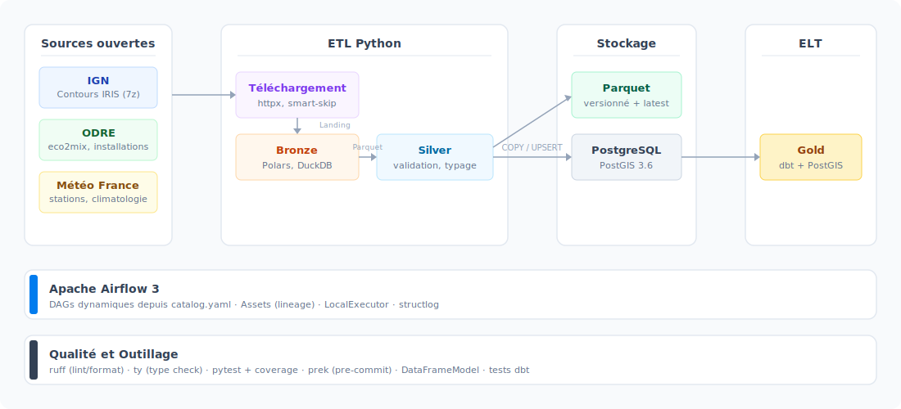

# ETL/ELT Open Data France - Électricité & Météo

Pipeline de données corrélant la **production électrique française** avec les
**données météorologiques**, de la collecte brute jusqu'aux modèles analytiques.


---

## Table des matières

- [Présentation](#présentation)
- [Architecture](#architecture)
- [Sources de données](#sources-de-données)
- [Stack technique](#stack-technique)
- [Structure du projet](#structure-du-projet)
- [Getting started](#getting-started)
- [Pipeline en détail](#pipeline-en-détail)
- [Qualité des données](#qualité-des-données)
- [Tests et qualité de code](#tests-et-qualité-de-code)
- [Documentation technique](#documentation-technique)
- [Roadmap](#roadmap)
- [Licence](#licence)

## Présentation

Projet personnel d'ingénierie des données qui collecte, transforme et analyse les
données ouvertes françaises sur la production d'électricité et la météorologie.
L'objectif : créer une plateforme de données unifiée corrélant les conditions
météorologiques avec la production/consommation électrique à travers la France.

**Fonctionnalités clés :**

- **Architecture médaillon** complète (Landing &rarr; Bronze &rarr; Silver &rarr; Gold)
  avec versionnement des fichiers et liens symboliques `latest`
- **Approche hybride ETL + ELT** : transformations Python (Polars/DuckDB) pour les
  couches bronze/silver, dbt + PostGIS pour la couche gold analytique
- **Smart-skip** : détection automatique des données inchangées via hash SHA-256
  et métadonnées HTTP, évitant les retraitements inutiles
- **Ingestion incrémentale** : diff pré-filtré côté Polars + upsert SQL pour les
  datasets volumineux (climatologie : ~18M lignes, eco2mix temps réel)
- **Validation de schémas** : `DataFrameModel` custom avec contraintes par colonne,
  détection de dérive de l'API source, et tests dbt sur la couche gold
- **Orchestration Airflow** : DAGs dynamiques générés depuis un catalogue YAML,
  chaînage par Assets (lineage file &rarr; Postgres &rarr; gold)
- **Jointure spatiale PostGIS** : appariement KNN des installations renouvelables
  avec la station météo la plus proche via les contours IRIS

## Architecture

<p align="center">
  
</p>

**Flux de données :**

1. **Téléchargement** &mdash; Les sources HTTP sont interrogées avec détection
   d'inchangé (hash SHA-256, `Last-Modified`). Le smart-skip évite les
   téléchargements redondants.
2. **Extraction** &mdash; Décompression conditionnelle (7z pour les données IGN).
3. **Bronze** &mdash; Conversion du format source vers Parquet versionné. Chaque
   version est horodatée, un lien symbolique `latest` pointe vers la plus récente.
   Traitement en streaming via `LazyFrame` + `sink_parquet`.
4. **Silver** &mdash; Transformations métier (renommage, typage, filtrage, colonnes
   dérivées), validation du schéma de sortie via `DataFrameModel`, détection de
   dérive du schéma source.
5. **Chargement Postgres** &mdash; `COPY` bulk pour les snapshots, `COPY` vers
   table staging + `UPSERT` SQL pour l'incrémental. Validation croisée des types
   Polars/Postgres avant chargement.
6. **Gold (dbt)** &mdash; Modèles analytiques matérialisés. Jointure spatiale PostGIS
   (KNN `<->`) pour apparier installations renouvelables et stations météo.

<!-- screenshot: Diagramme des DAGs Airflow dans l'UI (onglet "Assets" montrant le lineage file → Postgres → gold) -->

## Sources de données

| Dataset                     | Fournisseur  | Format    | Mode        | Description                                                     |
|-----------------------------|--------------|-----------|-------------|-----------------------------------------------------------------|
| `ign_contours_iris`         | IGN          | 7z (GPKG) | snapshot    | Contours IRIS infracommunaux (précision décamétrique)           |
| `odre_installations`        | ODRE         | Parquet   | snapshot    | Registre national des installations de production électrique    |
| `odre_eco2mix_cons_def`     | ODRE         | Parquet   | snapshot    | Production électrique régionale consolidée et définitive        |
| `odre_eco2mix_tr`           | ODRE         | Parquet   | snapshot    | Production électrique régionale en temps réel                   |
| `meteo_france_stations`     | Météo France | JSON      | snapshot    | Stations météorologiques (métadonnées, capacités de mesure)     |
| `meteo_france_climatologie` | Météo France | CSV.gz    | incrémental | Données climatologiques horaires (95 départements, ~18M lignes) |

**Dataset dérivé (Gold) :**
`installations_renouvelables_avec_stations_meteo` &mdash; Chaque installation
renouvelable active (solaire/éolien) appariée à la station météo la plus proche
capable de mesurer les paramètres pertinents.

## Stack technique

| Composant       | Technologie                     | Rôle                                                            |
|-----------------|---------------------------------|-----------------------------------------------------------------|
| Data processing | Polars, DuckDB, PyArrow         | Transformations bronze/silver, calculs géométriques (centroids) |
| Orchestration   | Apache Airflow 3                | DAGs dynamiques, scheduling, lineage par Assets                 |
| Base de données | PostgreSQL 17 + PostGIS 3.5     | Stockage silver/gold, jointures spatiales KNN                   |
| ELT analytique  | dbt-core + dbt-postgres         | Modèles gold matérialisés, tests de données                     |
| HTTP            | httpx (HTTP/2)                  | Téléchargement streaming avec smart-skip                        |
| Validation      | DataFrameModel custom, Pydantic | Schémas silver, configuration, settings                         |
| Logging         | structlog                       | Logs structurés (JSON en prod, console en dev)                  |
| Infrastructure  | Docker Compose                  | Postgres + Airflow (standalone)                                 |
| Qualité de code | ruff, ty, pytest, prek          | Lint, format, type check, tests, hooks pre-commit               |
| Gestion deps    | uv                              | Résolution et installation rapides                              |
| Notebooks       | Marimo                          | Exploration interactive des données                             |

## Structure du projet

```
.
├── src/data_eng_etl_electricity_meteo/
│   ├── airflow/dags/          # DAG factories (silver, postgres, gold)
│   ├── core/                  # Settings, logger, exceptions, data catalog
│   ├── pipeline/              # Orchestrateur, path resolver, state, métriques
│   ├── transformations/       # Bronze/silver par dataset + registry + validation
│   ├── loaders/               # Chargement Postgres (COPY, UPSERT)
│   ├── utils/                 # Download, extraction, hashing, helpers Polars
│   ├── custom_downloads/      # Stratégies de téléchargement spécifiques
│   ├── custom_metadata/       # Résolution de métadonnées (OpenDataSoft, data.gouv)
│   └── cli/                   # Points d'entrée en ligne de commande
├── dbt/
│   ├── models/silver/         # Staging views (1:1 sur les tables silver)
│   └── models/gold/           # Modèles analytiques matérialisés
├── data/
│   ├── catalog.yaml           # Catalogue déclaratif des datasets
│   ├── landing/               # Fichiers bruts téléchargés
│   ├── bronze/                # Parquet versionnés
│   ├── silver/                # Parquet transformés et validés
│   └── _state/                # État smart-skip par dataset (JSON)
├── postgres/
│   ├── init/                  # Scripts d'initialisation (bases, schémas)
│   ├── tables/                # DDL des tables silver
│   └── upsert/                # Templates SQL d'upsert incrémentaux
├── tests/                     # Tests unitaires et de cohérence
├── notebooks/                 # Notebooks Marimo (exploration)
├── docs/                      # Documentation technique détaillée
├── scripts/                   # Utilitaires (formateur docstrings, benchmarks)
├── docker-compose.yaml        # Postgres + Airflow
├── airflow.Dockerfile         # Image custom (Python 3.13, psycopg3, DuckDB)
└── pyproject.toml             # Dépendances et config outils (ruff, ty, pytest)
```

## Getting started

### Prérequis

- **Python 3.13+**
- **[uv](https://docs.astral.sh/uv/)** (gestionnaire de dépendances)
- **Docker** et **Docker Compose**

### Installation

```bash
# Cloner le dépôt
git clone https://github.com/<votre-utilisateur>/data-eng-etl-electricity-meteo.git
cd data-eng-etl-electricity-meteo

# Installer les dépendances Python
uv sync

# Configurer l'environnement
cp .env.example .env
cp .env.local.example .env.local
# Éditer .env et .env.local selon votre configuration
```

### Créer les secrets Docker

```bash
mkdir -p secrets
echo "votre_utilisateur_postgres" > secrets/postgres_root_username
echo "votre_mot_de_passe"        > secrets/postgres_root_password
openssl rand -base64 32          > secrets/airflow_api_secret_key
```

### Lancer les services

```bash
# Démarrer Postgres et Airflow
docker compose up --detach

# Vérifier que les services sont prêts
docker compose ps
```

| Service    | URL                   | Description                                                     |
|------------|-----------------------|-----------------------------------------------------------------|
| Airflow    | http://localhost:8080 | Interface web (identifiants dans les logs au premier lancement) |
| PostgreSQL | localhost:5432        | Bases `airflow` (interne) et `project` (données)                |

### Lancer le pipeline

**Via Airflow (recommandé)** &mdash; Activer les DAGs dans l'interface web.
Les DAGs sont générés dynamiquement depuis `catalog.yaml` :

- `to_silver_*` : téléchargement &rarr; bronze &rarr; silver (Parquet)
- `to_silver_pg_*` : chargement silver dans Postgres
- `to_gold_*` : transformations dbt (gold)

<!-- screenshot: Liste des DAGs Airflow avec leur statut (onglet "DAGs") -->

**Via CLI (exécution locale)** :

```bash
# Pipeline complet pour un dataset
uv run --env-file=.env.local python -m data_eng_etl_electricity_meteo.cli.run_pipeline <nom_dataset>

# Pipeline climatologie (téléchargement multi-fichiers)
uv run --env-file=.env.local python -m data_eng_etl_electricity_meteo.cli.run_meteo_climatologie
```

**dbt (couche gold)** :

```bash
# Exécuter les modèles gold
./scripts/dbt.sh run

# Lancer les tests dbt
./scripts/dbt.sh test
```

## Pipeline en détail

### Téléchargement et smart-skip

Le pipeline interroge les sources HTTP avec streaming (`httpx` HTTP/2) et calcule un
hash SHA-256 du fichier téléchargé. Si le hash correspond à la version précédente, les
étapes suivantes sont sautées.

Pour la climatologie Météo France, un téléchargement custom fusionne 95 fichiers
départementaux (un par département métropolitain) en un seul fichier landing.

### Bronze : normalisation

Chaque dataset source est converti en Parquet versionné. La transformation bronze
est minimale : sélection de colonnes, renommage, conversion de types basiques.
Le traitement utilise des `LazyFrame` Polars avec `sink_parquet` pour le streaming
mémoire sur les gros fichiers.

Les versions sont horodatées (`YYYY-MM-DDTHH-MM-SS.parquet`) et un lien symbolique
`latest` pointe toujours vers la version la plus récente.

### Silver : transformations métier

Les transformations silver appliquent les règles métier spécifiques à chaque dataset :
renommage de colonnes, typage strict, filtrage, colonnes dérivées, déduplication.
Le schéma de sortie est validé par un `DataFrameModel` déclaratif (contraintes
`nullable`, `unique`, `dtype`, bornes, valeurs autorisées).

Pour les datasets géospatiaux (IGN), DuckDB est utilisé pour les calculs de centroids
(`ST_Transform`, `ST_X`, `ST_Y`) directement depuis les fichiers GPKG.

### Chargement Postgres

Deux stratégies selon le mode d'ingestion :

- **Snapshot** : `TRUNCATE` + `COPY` (idempotent, ~5 datasets)
- **Incrémental** : `COPY` vers table staging &rarr; `UPSERT` depuis un template SQL
  (climatologie, eco2mix temps réel)

Avant chaque chargement, les types Polars sont validés contre le schéma Postgres.
Les métriques (lignes ajoutées, modifiées, inchangées) sont remontées au contexte
du pipeline.

### Gold : modèles analytiques (dbt)

La couche gold utilise dbt pour les transformations cross-datasets. Le modèle principal
apparie chaque installation renouvelable active (solaire/éolien) à la station météo la
plus proche capable de mesurer les paramètres pertinents, via une jointure spatiale
PostGIS (`CROSS JOIN LATERAL` + opérateur KNN `<->`).

## Qualité des données

La qualité est assurée à plusieurs niveaux du pipeline :

| Niveau   | Mécanisme                   | Description                                                                     |
|----------|-----------------------------|---------------------------------------------------------------------------------|
| Source   | `validate_source_columns()` | Détection de dérive du schéma API avant toute transformation                    |
| Silver   | `DataFrameModel`            | Contraintes déclaratives par colonne (types, nullabilité, unicité, bornes)      |
| Silver   | `validate_not_empty()`      | Protection contre les DataFrames vides après transformation                     |
| Postgres | `_validate_columns()`       | Vérification de cohérence des types Polars/Postgres avant `COPY`                |
| Gold     | Tests dbt                   | `not_null`, `unique`, `accepted_values`, `relationships` sur les modèles        |
| CI       | Tests de cohérence          | Validation automatique catalog &harr; registry &harr; dbt (références, nommage) |

## Tests et qualité de code

```bash
# Tests (avec couverture)
uv run pytest

# Lint + auto-fix
uv run ruff check --fix

# Formatage (100 caractères)
uv run ruff format

# Type checking
uv run ty check

# Tout d'un coup (équivalent aux hooks pre-commit)
uv run prek run --all-files
```

Les hooks `prek` exécutent automatiquement ruff, ty et pytest à chaque commit.

## Documentation technique

Le dossier [`docs/`](docs/) contient les notes de conception et décisions
d'architecture :

| Document                                                                                | Sujet                                          |
|-----------------------------------------------------------------------------------------|------------------------------------------------|
| [`architecture_etl_elt.md`](docs/architecture_etl_elt.md)                               | Justification de l'approche hybride ETL + ELT  |
| [`data_sources.md`](docs/data_sources.md)                                               | Documentation des sources de données et APIs   |
| [`data_quality_strategy.md`](docs/data_quality_strategy.md)                             | Stratégie de validation et détection de dérive |
| [`dataframe_model_custom.md`](docs/dataframe_model_custom.md)                           | Conception du DataFrameModel custom            |
| [`delta_incremental_silver.md`](docs/delta_incremental_silver.md)                       | Gestion de l'ingestion incrémentale            |
| [`integration_meteo_france.md`](docs/integration_meteo_france.md)                       | Intégration de l'API Météo France (phases)     |
| [`implementation_dbt_airflow.md`](docs/implementation_dbt_airflow.md)                   | Intégration dbt + Airflow                      |
| [`choix_technique_chargement_postgres.md`](docs/choix_technique_chargement_postgres.md) | Benchmark et choix du chargement Postgres      |
| [`oom_unique_silver.md`](docs/oom_unique_silver.md)                                     | Résolution du OOM sur déduplication silver     |
| [`airflow_structlog_custom_processors.md`](docs/airflow_structlog_custom_processors.md) | Processeurs structlog custom pour Airflow      |

## Roadmap

Voir [`TODO.md`](TODO.md) pour la liste complète des évolutions prévues.

## Licence

Ce projet est distribué sous licence MIT. Voir le fichier [LICENSE](LICENSE) pour
plus de détails.
